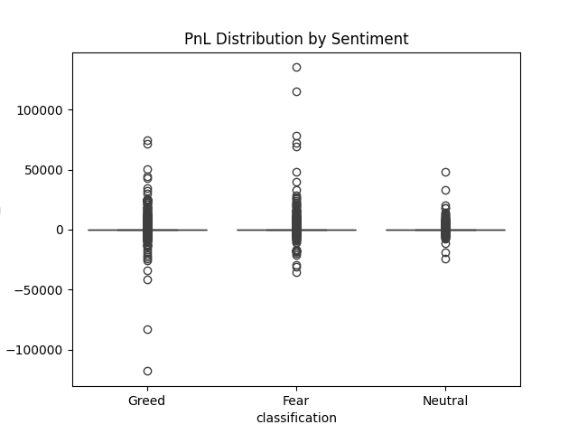
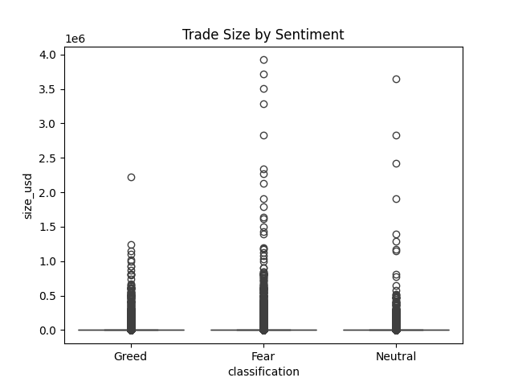

# 📊 Trader Performance vs Market Sentiment Analysis

## 🧠 Objective
Analyze how market sentiment (Fear/Greed) affects trader behavior and performance using Hyperliquid trading data. The goal is to uncover patterns that can inform smarter trading strategies.

---

## 📂 Datasets
- Bitcoin Market Sentiment (Fear/Greed Index)
- Historical Trader Data (Hyperliquid)

---

## ⚙️ Methodology

### 1. Data Preparation
- Converted timestamps to date format
- Checked and handled missing values
- Merged datasets on daily level using date

### 2. Feature Engineering
- Daily PnL (profit & loss)
- Trade frequency
- Average trade size
- Long/Short ratio

### 3. Analysis
- Compared trader behavior across Fear, Greed, and Neutral sentiment
- Used boxplots and tables for visualization
- Evaluated performance and behavioral differences

---

## 📊 Key Insights

1. **Higher Trading Activity in Greed**
   - Traders are most active during Greed periods, indicating strong market participation.

2. **Higher Risk-Taking in Fear**
   - Traders take larger position sizes during Fear periods, suggesting emotional or recovery-driven trading.

3. **Higher Volatility in Fear Markets**
   - Fear periods show wider PnL distribution with extreme gains and losses.

4. **Short Bias in Greed**
   - Traders exhibit slight short bias even during Greed, indicating hedging or profit booking.

---

## 📈 Visualizations

### PnL Distribution by Sentiment

### Trade Size Distribution by Sentiment

---

## 🚀 Strategy Recommendations

### 1. Risk Control During Fear
- Reduce position size (30–50%)
- Use strict stop-loss
- Avoid aggressive or emotional trading

### 2. Controlled Participation During Greed
- Increase trading activity cautiously
- Use profit-booking strategies
- Apply trailing stop-loss
- Consider hedging near market peaks

---

## 🛠️ Tools Used
- Python (Pandas, Matplotlib, Seaborn)
- Jupyter Notebook

---

## ▶️ How to Run

1. Clone the repository:
# 📊 Trader Performance vs Market Sentiment Analysis

## 🧠 Objective
Analyze how market sentiment (Fear/Greed) affects trader behavior and performance using Hyperliquid trading data. The goal is to uncover patterns that can inform smarter trading strategies.

---

## 📂 Datasets
- Bitcoin Market Sentiment (Fear/Greed Index)
- Historical Trader Data (Hyperliquid)

---

## ⚙️ Methodology

### 1. Data Preparation
- Converted timestamps to date format
- Checked and handled missing values
- Merged datasets on daily level using date

### 2. Feature Engineering
- Daily PnL (profit & loss)
- Trade frequency
- Average trade size
- Long/Short ratio

### 3. Analysis
- Compared trader behavior across Fear, Greed, and Neutral sentiment
- Used boxplots and tables for visualization
- Evaluated performance and behavioral differences

---

## 📊 Key Insights

1. **Higher Trading Activity in Greed**
   - Traders are most active during Greed periods, indicating strong market participation.

2. **Higher Risk-Taking in Fear**
   - Traders take larger position sizes during Fear periods, suggesting emotional or recovery-driven trading.

3. **Higher Volatility in Fear Markets**
   - Fear periods show wider PnL distribution with extreme gains and losses.

4. **Short Bias in Greed**
   - Traders exhibit slight short bias even during Greed, indicating hedging or profit booking.

---

## 📈 Visualizations

### PnL Distribution by Sentiment

### Trade Size Distribution by Sentiment

---

## 🚀 Strategy Recommendations

### 1. Risk Control During Fear
- Reduce position size (30–50%)
- Use strict stop-loss
- Avoid aggressive or emotional trading

### 2. Controlled Participation During Greed
- Increase trading activity cautiously
- Use profit-booking strategies
- Apply trailing stop-loss
- Consider hedging near market peaks

---

## 🛠️ Tools Used
- Python (Pandas, Matplotlib, Seaborn)
- Jupyter Notebook

---

## ▶️ How to Run

1. Clone the repository:
git clone https://github.com/your-username/trader-sentiment-analysis.git
2. Install dependencies:
pip install pandas matplotlib seaborn
3. Run:
notebook.ipynb

---

## 📌 Conclusion

Market sentiment strongly influences trader behavior and performance. While Greed drives higher participation, Fear leads to increased risk-taking and volatility. Adapting strategies based on sentiment can significantly improve trading outcomes.